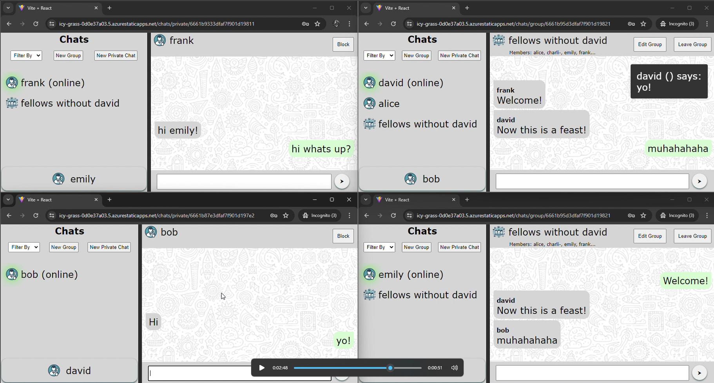

# Messenger

chat application using:
react + socket.io for client and
nodejs + socket.io + mongodb + sqlite for server.

see README files in [client](client/README.md) and [server](server/README.md) for more details.

Core flows between client and server where described in graphs in [flows.drawio](./flows.drawio). use [draw.io plugin](https://marketplace.visualstudio.com/items?itemName=hediet.vscode-drawio) in vscode to view them.

image:

video:

